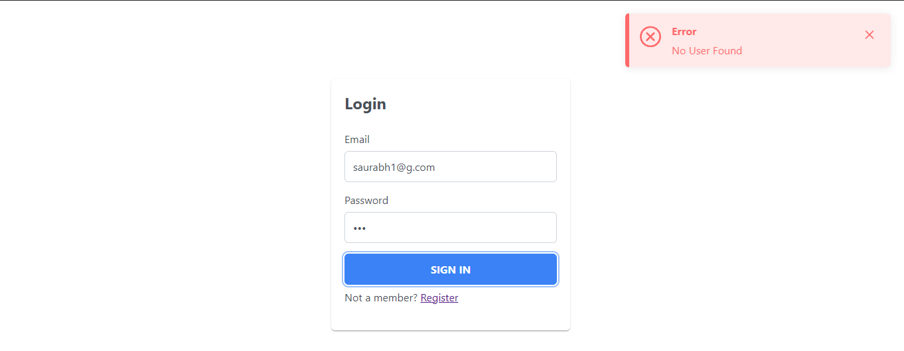
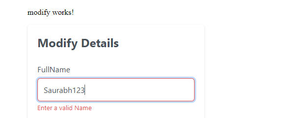

# Angular App 

In this project i've made registration form, login form and user details modification form using in memory user data.

## Login form

- Login form taken in input as email and password.
- The form throws and error if the email does not exist.

## Register form

- Registration form takes fullname, email and password.
- If the user with email already exist it throws an error.
  
- Have put validation in place for name field so that it does not contain any number. 

## Modification Form

- Modification form takes fullname, email.

- Have put validation in place for name field so that it does not contain any number.
  

